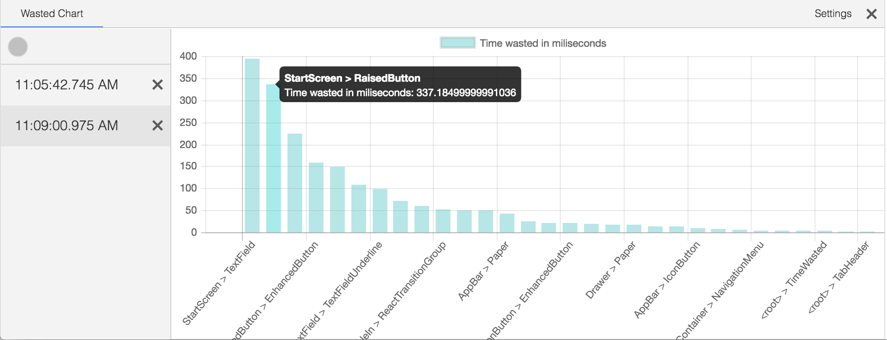

# ReactPerfTool

[](http://packagequality.com/#?package=react-perf-tool)
[](https://travis-ci.org/RamonGebben/react-perf-tool) [](https://gitter.im/RamonGebben/react-perf-tool?utm_source=badge&utm_medium=badge&utm_campaign=pr-badge)
[](https://badge.fury.io/js/react-perf-tool)
[](https://github.com/RamonGebben/react-perf-tool/blob/master/LICENSE)

ReactPerfTool tries to give you a more visual way of debugging performance of your React application.
It does this by using the addons delivered by the React team and community to get measurements and visualize this using graphs. This makes it easier to spot bottlenecks.



## Usage

```bash
npm i react-perf-tool react-addons-perf -D
```

```javascript
import ReactPerfTool from 'react-perf-tool';
import Perf from 'react-addons-perf';

export default function YourApp(props) {
  return (<div className="your-app">
    {/*...yourApp */}
    <ReactPerfTool perf={Perf} />
  </div>);
}
```

## Contributing

If you want to contribute just fork the project and start working on one of the open issues or on your own ideas.
When you are done you can open a pull request.

### Code style
The project uses a trimmed down version of the [Airbnb Javascript styleguide](https://github.com/airbnb/javascript), and can be checked by running:

```bash
npm run lint
```

### Testing
For testing the project uses [Mocha](http://mochajs.org/) and [Chai](http://chaijs.com/).
For testing of components the project uses [Enzyme](https://github.com/airbnb/enzyme).

### TL;DR

* `npm run build` - produces production build
* `npm run dev` - start webpack watch
* `npm run test` - runs the tests and lints
  - `npm run lint` - lints all the code
  - `npm run test:unit` - run only the unit tests
  - `npm run test:component` - run only the component tests
